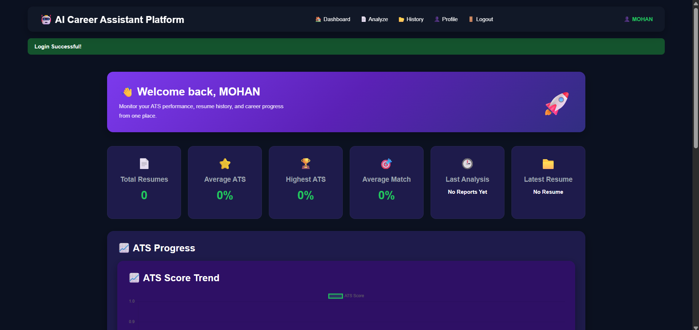
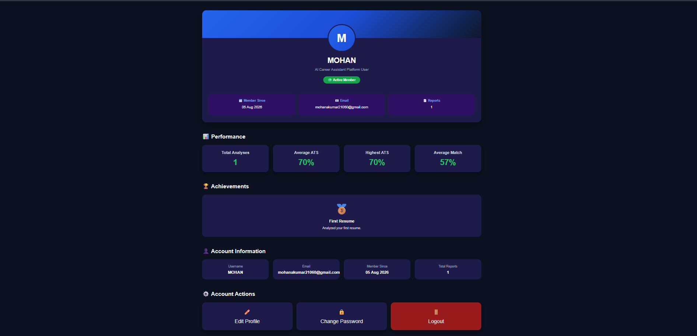

# 🤖 AI Resume Analyzer

<div align="center">


### 🚀 AI-powered Resume Analysis Platform with ATS Scoring, Job Matching & Career Recommendations

</div>

---

# 📌 Overview

AI Resume Analyzer is a full-stack web application that helps job seekers improve their resumes using Artificial Intelligence.

The platform analyzes uploaded resumes, calculates an ATS score, identifies missing skills, compares resumes against job descriptions, generates AI-powered feedback, creates personalized cover letters, and provides career improvement suggestions.

This project was built using **Flask**, **SQLite**, and **Google Gemini AI** and is deployed on **Render**.

---

# 🌐 Live Demo

🔗 **Live Website**

https://ai-resume-analyzer-890p.onrender.com

---

# ✨ Features

## 🔐 User Authentication

- User Registration
- Secure Login
- Logout
- Change Password
- Edit Profile

---

## 📄 Resume Analysis

- Upload Resume (PDF/DOCX)
- Resume Parsing
- ATS Score Calculation
- Skill Extraction
- Missing Skill Detection

---

## 🎯 Job Matching

- Paste Job Description
- AI Job Matching
- Match Score
- Missing Job Skills
- Matched Skills

---

## 🤖 AI Features

Powered by Google Gemini AI

- AI Resume Review
- Resume Improvement Suggestions
- Career Roadmap
- AI Generated Cover Letter

---

## 📊 Dashboard

- Total Reports
- Last Analysis
- Resume History
- User Profile

---

## 📥 Report Features

- Download PDF Report
- Email Resume Report
- Resume History

---

# 🖥️ Screenshots

## Dashboard



---

## Resume Upload


---

## ATS Analysis


---

## AI Resume Review


---

## Resume History


---

## Profile



---

# ⚙️ Tech Stack

## Frontend

- HTML5
- CSS3
- JavaScript

---

## Backend

- Python
- Flask
- Flask Login
- Flask SQLAlchemy
- Flask Mail

---

## Artificial Intelligence

- Google Gemini API

---

## Database

- SQLite

---

## Deployment

- Render

---

## Version Control

- Git
- GitHub

---

# 📂 Project Structure

```
AI-RESUME-ANALYZER
│
├── analyzer/
│
├── static/
│   ├── css/
│   └── images/
│
├── templates/
│
├── uploads/
│
├── Screenshots/
│
├── app.py
├── models.py
├── database.py
├── requirements.txt
├── runtime.txt
└── README.md
```

---

# 🚀 Installation

## Clone Repository

```bash
git clone https://github.com/YOUR_GITHUB_USERNAME/AI-RESUME-ANALYZER.git

cd AI-RESUME-ANALYZER
```

---

## Create Virtual Environment

```bash
python -m venv venv
```

Windows

```bash
venv\Scripts\activate
```

Linux / Mac

```bash
source venv/bin/activate
```

---

## Install Dependencies

```bash
pip install -r requirements.txt
```

---

## Run Application

```bash
python app.py
```

Open

```
http://127.0.0.1:5000
```

---

# 📊 Workflow

```
User
   │
   ▼
Register/Login
   │
   ▼
Dashboard
   │
   ▼
Upload Resume
   │
   ▼
Extract Resume Text
   │
   ▼
ATS Analysis
   │
   ▼
Job Description Matching
   │
   ▼
Google Gemini AI
   │
   ▼
AI Resume Review
   │
   ▼
Career Suggestions
   │
   ▼
Cover Letter Generation
   │
   ▼
Download PDF / Email Report
```

---

# 🎯 Future Improvements

- Multiple Resume Templates
- AI Mock Interview
- LinkedIn Profile Analyzer
- Resume Version Comparison
- Recruiter Dashboard
- Multi-language Resume Support
- Dark/Light Theme
- Resume Keyword Optimization
- AI Resume Chat Assistant

---

# 💡 Learning Outcomes

During this project I learned:

- Flask Web Development
- Authentication using Flask Login
- Database Design with SQLAlchemy
- REST Routing
- Google Gemini AI Integration
- Resume Parsing
- ATS Scoring Logic
- PDF Report Generation
- Email Automation
- Responsive UI Design
- Git & GitHub
- Cloud Deployment on Render

---

# 👨‍💻 Author

## Mohanakumar S

B.Tech Electronics and Computer Engineering

VIT Chennai

GitHub

https://github.com/mohanakumar21

LinkedIn

https://www.linkedin.com/in/mohanakumar21/

---

# ⭐ If you like this project

Please consider giving this repository a ⭐ on GitHub.

---

# 📜 License

This project is licensed under the MIT License.

---

<div align="center">

### 🚀 Built with ❤️ using Flask + Google Gemini AI

</div>